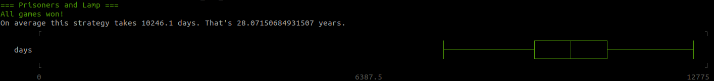
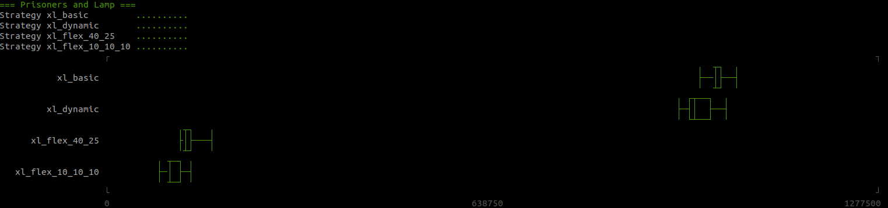

# Solution

The basic idea is that one prisoner (`the counter`) counts the other prisoners (`the regulars`). Each regular has to turn the lamp on exactly once. The counter has to turn the lamp off 99 times.

## Known optimizations:

#### Dynamic counter

The prisoners only behave according to the basic strategy from day 101 onwards. During the first 100 days, they do the following:
- Turn on the lamp on day 1 and consider yourself as counted
- If the lamp is on when you enter the room, consider yourself as counted
- If you enter the room for the second time and the lamp is still on, turn off the lamp and become the counter. If that happened on day `N`, you thereby counted `N-2` other prisoners.

#### Nested counters

Instead of having one prisoner counting to 99 `1s`, we have two types of counters: `major counters` (they count `10s`) and `minor counters` (they count `1s`). The prisoners need to agree on a fixed schedule in advance, e.g. every 1000 days we switch between counting `1s` and counting `10s`.

#### Other subdivisions

Instead of counting `1s` and `10s`, why not count `1s` and `20s`? Or `1s` and `5s` and `25s`? I implemented `versatile.rb` and `flex.rb` which can deal with any number of prisoners and with arbitrary factorizations of that total number. `flex.rb` is easier to use, because it assigns roles to the prisoners dynamically. With `versatile.rb` you need to do that manually, but the end result will be slightly faster in most cases, because the prisoners don't need the role assignment phase.

## Other solutions:

#### Waiting for a "lucky interval"

This is basically an extreme version of the "Dynamic counter" solution. The prisoners only do the first 100 days of that strategy, but repeatedly:
- End the game if nobody entered the lamp room twice for 100 days
- If that failed, forget everything and repeat the whole procedure in the next interval of 100 days

This strategy depends on a very unlikely event with the probability of `100! / 100^100`. As the prisoners don't accumulate knowledge, this strategy will take a very long time: `2.9 * 10^41 years`. With only 10 prisoners this still takes 75.5 years on average.

#### The "perfect-knowledge" solution

If the prisoners would simply know, when the last one entered the room, they could end the game at the earliest possible opportunity. I implemented this "strategy" as a benchmark to see how far off the real solutions are.

# Running the code

See the list of available strategies within `strategies.rb`.

## Single strategy



To run the simulation with the basic strategy, simply execute (from this directory) 
```bash
./main.rb
```
For a list of available options, run
```bash
./main.rb -h
```
As an example, the following command would run the strategy `xl_flex_10_10_10` with a reduced sample size of 10 (recommended for all `xl_` strategies) and with verbose output:
```bash
./main.rb -v -n 10 -s xl_flex_10_10_10
```

CAUTION:
- The final box plot will be normalized depending on the number of prisoners in the used strategy.
- The strategies `lucky_interval` and `xl_lucky_interval` will not terminate. If they do, you should go play the lottery today.

## Strategy comparison



For a list of available options, run
```bash
./compare.rb -h
```
As an example, the following command would compare the strategies `basic`, `dynamic` and `nested`:
```bash
./compare.rb -s basic,dynamic,nested
```

CAUTION:
- For a fair comparison you should only run strategies with the same number of prisoners against each other, e.g. only `xl_` strategies.
- For prisoner counts other than 100 you should specify that, e.g. with `-p 1000` for `xl_` strategies, so the box plots will be normalized reasonably.
- If you don't decrease the sample size (e.g. `-n 10`) when comparing many strategies or `xl_` strategies, this will take a long time.

