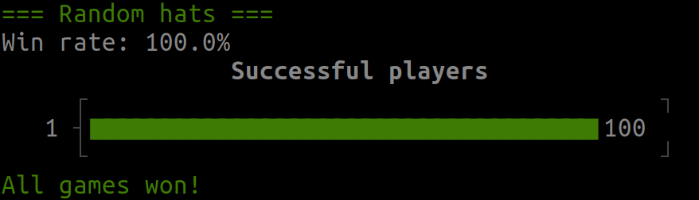

# Solution

Give each player a number from 0 to 99. Give each hat type a number from 0 to 99. Player `n` bets on `(n - sum("other's hats")) modulo 100`.

## Explanation

The condition for winning is that `at least one` player guesses correctly. However, each individual player has no possibility of increasing their winning chance as their own hat is picked independently from the other player's hats. Therefore, we have `100 players`, each with a chance of `1/100` for guessing correctly. Thus, it is true regardless of the strategy that `on average one` player guesses correctly.

If "minimum" and "average" are supposed to be equal, then the "maximum" also needs to be that value. We need to find a strategy where always `exactly one` player wins.

Here is such a strategy:
- The `sum of all hats modulo 100` is always a number between `0` and `99`.
- Player `n` will assume that this value is equal to `n`.
- Exactly one such assumption will be correct.
- For the actual bet each player calculates their own hat from `their assumption` and the `99 other hats` that they can see.

# Running the code

See the list of available strategies within `strategies.rb`.



To run the simulation with the basic strategy, simply execute (from this directory)
```bash
./main.rb
```
For a list of available options, run
```bash
./main.rb -h
```
As an example, the following command would run the strategy `xxs_random` with a larger sample size of 1000 and with verbose output:
```bash
./main.rb -v -n 1000 -s xxs_random
```
