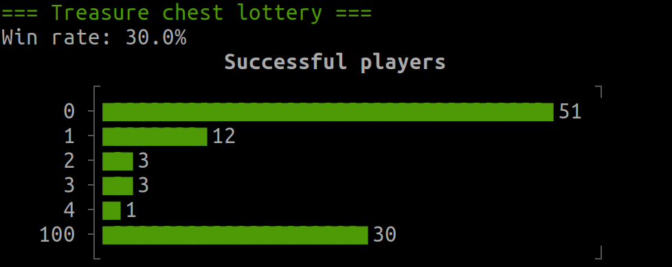

# Solution

If player 24 tries to find `token 24`, they need to first open `chest 24`. There, they might discover `token 91`, so next they should open `chest 91`. They will always open the chest corresponding to the token they discovered previously.

## Explanation

The players' numbers (tokens) are shuffled and put into the treasure chests. This is a combinatorial "permutation". Permutations always decompose into "cycles" (although it is possible, that the whole permutation is a single cycle).

Example:
```
# Situation
chest: 1 2 3 4 5 6
token: 1 3 2 5 6 4

# This permutation decomposes into 3 cycles:
(1)(2 3)(4 5 6)
```

The main idea for the efficient strategy is now that each player needs to `start within the cycle that contains their token` and then needs to `walk along the cycle` to end up at their own token.

In the shown example, player 4 would:
- open `chest 4` and discover `token 5`
- open `chest 5` and discover `token 6`
- open `chest 6` and discover their own `token 4`

Strategy:
- All players start by opening `the chest corresponding to their player number`. This chest is guaranteed to be contained in the same cycle as `the chest containing the player's token`.
- As subsequent chests every player opens `the chest corresponding to the token found in the previous chest`. This equals "walking along the cycle". The player will find `the chest containing their token` as the final chest in the cycle.

Caveat:
- As each player is only allowed to open 50 chests, this strategy will only lead a player to their own token fast enough if their cycle is no larger than 50 chests.
- As the players "win as a group" and "all of them" need to find their token, this size constraint needs to hold for all cycles.

Thus, our players will win, if the gnome shuffles the numbers in such a way that no cycle is larger than 50.

## Calculating the chance of winning

A general formula for the probability that `a permutation of n elements contains a cycle of length l` needs to consider that multiple cycles of length l could exist. We can disregard that case, because a permutation of 100 elements can't contain more than a single cycle of length 51 or greater.

The probability of a permutation of 100 elements containing a cycle of length l is:
```latex
P_{cycle}(l) = \binom{100}{l} * (l - 1)! * (100 - l)! = \frac{100!}{l} \qquad(\text{for}\ l > 50)
```

The probability of a permutation of 100 elements containing no cycle with a length greater than m is:
```latex
P_{no\ cycle\ longer\ than}(m) = 1 - \frac{1}{100!} \sum_{l = m+1}^{100} P_{cycle}(l) = 1 - \sum_{l = m+1}^{100} \frac{1}{l} \qquad(\text{for}\ m \ge 50)
```

This gives us the probability for winning the treasure chest lottery for `m = 50`:
```latex
P_{no\ cycle\ longer\ than}(50) \approx  0.31183
```

Thus, our players can raise their chance of winning from `0.5 ^ 100` (which is roughly `8 * 10^(-31)`) to more than 30% (so `3 * 10^(-1)`). That's an improvement of `30 orders of magnitude`.

For larger amounts of players, this probability converges to `1 - ln 2` (roughly `0.30685`), so it stays above 30% for an arbitrary number of players.

# Running the code

See the list of available strategies within `strategies.rb`.



To run the simulation with the basic strategy, simply execute (from this directory)
```bash
./main.rb
```
For a list of available options, run
```bash
./main.rb -h
```
As an example, the following command would run the strategy `xxs_random` with a larger sample size of 1000 and with verbose output:
```bash
./main.rb -v -n 1000 -s xxs_random
```
